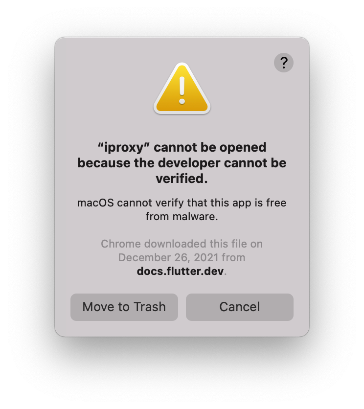

# iProxy cannot be opened because the developer cannot be verified

Are you getting an error like this?

Delete the `flutter/bin/cache/artifact` directory.

If that doesn't work, it is a permission issue: run
`flutter/bin/cache/artifacts/usbmuxd/iproxy` and add it to the exception list.

[Source](https://stackoverflow.com/questions/71359062/iproxy-cannot-be-opened-because-the-developer-cannot-be-verified)
