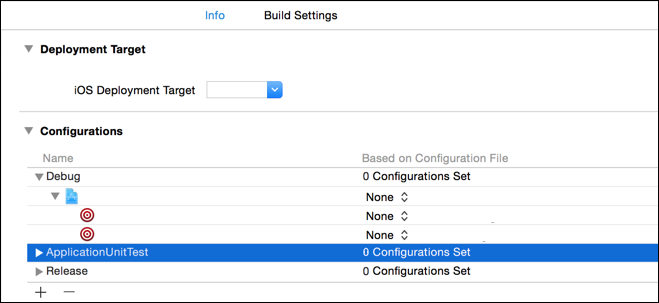

# Command PhaseScriptExecution failed with a nonzero exit code

If an iOS build returns an error similar to the above:

## On the terminal

```
flutter clean
flutter pub get
flutter pub upgrade
```

## In Xcode

Show Project Navigator → Project → Info → Configurations → for each target
(and each target within the target) set the configuration to **None**.



## Again on the terminal

```
cd iOS
rm -rf Pods/ Podfile.lock
pod install
pod update
```
