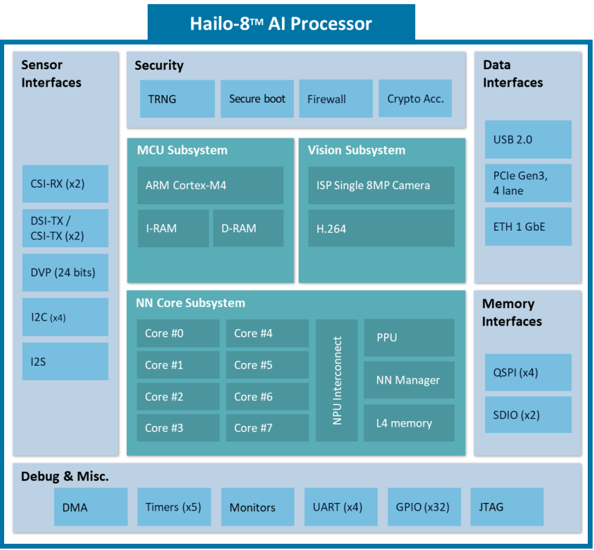

# [Hailo AI Processors](https://hailo.ai)

## Hailo 8
  
[Source](https://us1.discourse-cdn.com/flex015/uploads/hailo/original/2X/0/0c06545f5fad58379c2c1f3ffc678432158f3488.png)

1. Why is Hailo a complete SOC, but it still needs to be connected to another processor through methods such as PCIE? And it seems that all the programs are running on external processors (for example, external processors need to download software like Hailo RT). If this is the case, then what are the functions of the Cortex M4 core on the Hailo 8 and other peripherals such as I2C, USB, and ETH?
		
	**The Hailo-8 isn’t designed to work as a standalone general-purpose processor.** It’s built specifically as a high-efficiency neural network accelerator.
		Here’s how it works:
		- The Cortex-M4 core isn’t meant for running your applications. It mainly handles internal tasks like configuration, device management, and some basic control functions needed for coordination.
		- The PCIe interface is where the real action happens - it’s how data flows in and out of the Hailo-8’s NN core.
		- While the Hailo-8 does have I2C, SPI, and GPIO interfaces, these are mainly for auxiliary functions or board-level integration - things like signaling or basic control, not full system operation.
		So essentially, the Hailo-8 is an accelerator that needs external processors to handle the application-level software.
2.  The NN Core is considered to be the core of Hailo 8. However, the documentation does not provide a very detailed introduction to this NN Core. I would like to know which architectures (such as pulse array) this NN Core uses to accelerate the operation of neural networks.
	The actual acceleration methods are our intellectual property, so we can’t share those details. [Source](https://community.hailo.ai/t/hailo8-hardware-architecture/15454/2)
* The processor onboard the HAILO is not well suited to the tasks of h.264 decode, motion detection, etc. The HAILO is very well suited to image classification of those motion detected video frames. [Source](https://community.hailo.ai/t/hailo8-hardware-architecture/15454/4)
* The Hailo-8L is an accelerator designed to run the compute intensive part of neural network inference. To make use of it, you must describe your function as a network (e.g. Pytorch or Tensorflow) using layers supported by the Hailo Dataflow Compiler. Have a look at the Hailo Dataflow Compiler User guide for a complete description of the supported layers. There is no low level API that would allow you to just program any function you want. The Hailo devices are not general purpose GPUs. [Source](https://community.hailo.ai/t/vision-acceleration-on-rpi-hailo-8l/12402/2)

### Once Ready,
The best starting point is [hailo-rpi5-examples on Github](https://github.com/hailo-ai/hailo-rpi5-examples)

https://github.com/hailo-ai/hailo-apps-infra

