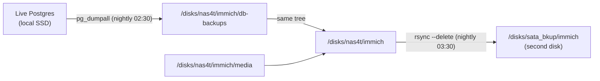

# Backing up a self-hosted Immich

Immich (the self-hosted Google Photos alternative) is worth backing up carefully
because it is really *two* things glued together, and they fail in different ways:

- the **media** — the actual photo and video files on disk, and
- the **database** — Postgres, holding the library index, albums, people/faces,
  and the machine-learning results.

Lose the media and the photos are gone. Lose the database and the photos are still
*there* on disk, but Immich no longer knows what they are — no albums, no dates, no
faces, no order. Both are irreplaceable, and a good backup covers both.

!!! note "About the paths"
    Paths like `/disks/nas4t` and `/disks/sata_bkup` below are from my box —
    substitute your own primary data disk and backup disk. The *shape* is the
    point, not the exact mount points.

## The layout: media and database live apart on purpose

| what | where | why |
| --- | --- | --- |
| **media** (`UPLOAD_LOCATION`) | big data disk, e.g. `/disks/nas4t/immich/media` | photos need room to grow |
| **live database** (`DB_DATA_LOCATION`) | **local** OS/SSD disk, a bind mount | Postgres must *not* run on a network/NAS-style mount — it corrupts |
| **DB dumps** | next to the media, e.g. `/disks/nas4t/immich/db-backups` | so one backup pass sweeps up both |
| **second copy** | a separate backup disk, e.g. `/disks/sata_bkup/immich` | the actual off-primary-disk backup |

The key decision: the **live** database sits on a fast local disk (never the NAS),
but its nightly **dump** is written onto the data disk right next to the media.
That way a single mirror of one directory tree (`immich/`) captures the media *and*
the database dump together.



Three physical copies of the irreplaceable bits result: the live DB on the SSD, its
dump on the data disk, and the whole tree mirrored to a second disk.

## Part 1 — the nightly database dump

`pg_dumpall` runs *inside* the Postgres container, so no Postgres client is needed on
the host. The dump is gzipped and old ones are pruned. `--clean --if-exists` makes the
dump restorable onto a fresh cluster.

```bash
#!/usr/bin/env bash
# Nightly Immich Postgres backup: pg_dumpall -> gzip -> data disk, prune > 14 days.
set -euo pipefail

DEST=/disks/nas4t/immich/db-backups
CONTAINER=immich_postgres
DB_USER=postgres
KEEP_DAYS=14

mkdir -p "$DEST"
OUT="$DEST/immich-$(date +%Y%m%d-%H%M%S).sql.gz"

docker exec -t "$CONTAINER" pg_dumpall --clean --if-exists --username="$DB_USER" \
  | gzip > "$OUT.tmp"
mv "$OUT.tmp" "$OUT"                      # atomic: never leave a half-written .sql.gz

find "$DEST" -name 'immich-*.sql.gz' -type f -mtime +"$KEEP_DAYS" -delete
```

!!! tip "Write to `.tmp`, then rename"
    Piping straight into the final filename means an interrupted run leaves a
    truncated dump that *looks* like a valid backup. Writing to `OUT.tmp` and
    `mv`-ing on success makes the final file appear only when the dump completed.

## Part 2 — the second copy on another disk

A dump on the same disk as the live data protects against a bad `DELETE`, not against
the disk dying. So mirror the whole `immich/` tree — media **and** the dumps — onto a
second disk. One `rsync` covers both because the dump lives inside that tree.

```bash
#!/usr/bin/env bash
# Mirror the whole Immich tree (media + DB dumps) onto a second disk.
set -euo pipefail

SRC=/disks/nas4t/immich/
DEST=/disks/sata_bkup/immich/

# Refuse to mirror into an unmounted backup disk (would fill the root fs).
mountpoint -q /disks/sata_bkup || { echo "backup disk not mounted" >&2; exit 1; }

# CRITICAL with --delete: refuse if the source looks empty (e.g. NAS not mounted),
# otherwise the mirror would happily DELETE the good backup.
[[ -d "$SRC" && -n "$(ls -A "$SRC" 2>/dev/null)" ]] || { echo "source empty/missing" >&2; exit 1; }

mkdir -p "$DEST"
rsync -ah --delete --partial --info=progress2 "$SRC" "$DEST"
```

!!! danger "`--delete` needs a guard"
    A mirror (`--delete`) tracks the source exactly, including deletions — which is
    what you want, *until* the source disappears. If the NAS fails to mount, `SRC`
    is an empty directory, and `rsync --delete` will erase the entire backup to
    "match" it. The two guards above (backup mounted, source non-empty) turn that
    disaster into a clean refusal. This is the single most important line in the
    whole setup.

This job must run **after** the dump, so it picks up the freshest one — schedule it an
hour later (see below).

## Scheduling with user systemd timers

Both scripts run as a **user** systemd timer (not root cron), so they run as the same
user that owns the Docker socket and the files.

```ini
# ~/.config/systemd/user/immich-db-backup.timer      -> 02:30
# ~/.config/systemd/user/immich-backup-copy.timer    -> 03:30
[Timer]
OnCalendar=*-*-* 02:30:00
Persistent=true          # if the box was off at 02:30, run at next boot
[Install]
WantedBy=timers.target
```

```bash
systemctl --user daemon-reload
systemctl --user enable --now immich-db-backup.timer immich-backup-copy.timer
systemctl --user list-timers 'immich*'
```

!!! warning "Enable lingering, or the timers die at logout"
    User timers only run while the user has a session — they stop when you log out
    of SSH. `sudo loginctl enable-linger $USER` keeps the user manager (and its
    timers) running with no login. Easy to forget; the symptom is "the backup ran
    while I was testing, then silently never again."

## Restoring

**Database** — restore the latest dump onto a running (fresh) Postgres container;
the `--clean --if-exists` in the dump drops and recreates as it goes:

```bash
LATEST=$(ls -t /disks/nas4t/immich/db-backups/*.sql.gz | head -1)
zcat "$LATEST" | docker exec -i immich_postgres psql -U postgres -d postgres
docker restart immich_server
```

**Media** — it is just files, so copy it back into place:

```bash
rsync -ah --info=progress2 /disks/sata_bkup/immich/media/ /disks/nas4t/immich/media/
```

Restore order for a full rebuild: bring up the stack with an empty DB, restore the
dump *before* the first real use, then restore the media.

## What I learned

- **Back up both halves, and know what each protects.** The media is the files; the
  database is the meaning. A media-only backup gives you a shoebox of unsorted photos.
- **The live DB belongs on local disk; only its dump goes to the NAS.** Running
  Postgres directly on a network mount is a corruption trap.
- **Put the dump inside the media tree** so a single mirror backs up everything.
- **A `--delete` mirror is a loaded gun without a source-not-empty guard** — an
  unmounted source turns "sync" into "wipe the backup."
- **User timers need lingering enabled** or they quietly stop after you log out.
