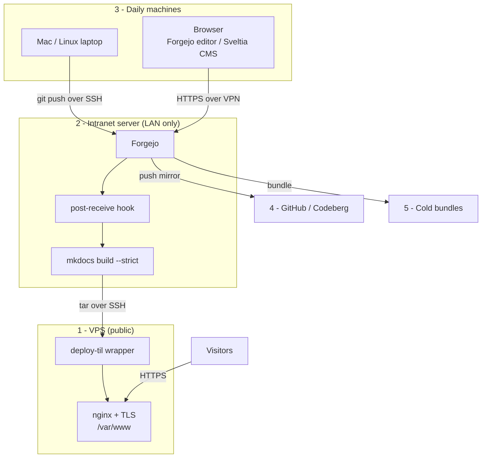

# Self-hosting this TIL site: Forgejo on the LAN, static VPS

A runbook for building, publishing and backing up this site. Git hosting and
the build stay inside the LAN. The public VPS serves static files only.

!!! note "About the placeholders"
    Values in `ANGLE_BRACKETS` are specific to my machines and are not
    published. Substitute your own.

## The machines

| # | Role | Runs |
| --- | --- | --- |
| 1 | VPS (public) | nginx, certbot. Static files only |
| 2 | Intranet server | Forgejo, MkDocs build, deploy, mirror |
| 3 | Daily machines | Mac, Linux laptop, browser |
| 4 | GitHub / Codeberg | automatic push mirror |
| 5 | Cold storage | dated bundles on external disk / NAS |

## How it connects



Every connection is initiated from inside the LAN. The VPS holds no
credentials and no route to any other machine.

## 1. Prepare the intranet server

```bash
sudo adduser --disabled-password --gecos "" git
sudo apt update
sudo apt install git python3 python3-venv rsync
```

## 2. Install Forgejo

Download from <https://forgejo.org/download/>. Version 12.0 or later is
required for the CMS in step 9.

```bash
sudo install -m 755 forgejo-*-linux-amd64 /usr/local/bin/forgejo
sudo mkdir -p /var/lib/forgejo /etc/forgejo
sudo chown git:git /var/lib/forgejo
sudo chown root:git /etc/forgejo && sudo chmod 770 /etc/forgejo
```

`/etc/systemd/system/forgejo.service`:

```ini
[Unit]
Description=Forgejo
After=network.target

[Service]
User=git
Group=git
WorkingDirectory=/var/lib/forgejo
ExecStart=/usr/local/bin/forgejo web --config /etc/forgejo/app.ini
Restart=always
Environment=USER=git HOME=/home/git GITEA_WORK_DIR=/var/lib/forgejo

[Install]
WantedBy=multi-user.target
```

```bash
sudo systemctl enable --now forgejo
```

Complete the web installer, then set in `/etc/forgejo/app.ini`:

```ini
[server]
DOMAIN     = <LAN_HOSTNAME>
ROOT_URL   = https://<LAN_HOSTNAME>/
HTTP_ADDR  = <LAN_OR_VPN_ADDRESS>
HTTP_PORT  = 3000

[service]
DISABLE_REGISTRATION = true

[security]
INSTALL_LOCK = true
```

```bash
sudo systemctl restart forgejo
```

Enable 2FA under **Settings → Account → Two-Factor Authentication**.

## 3. Reach it from outside the LAN

Install Tailscale (or WireGuard) on the intranet server and on every daily
machine:

```bash
curl -fsSL https://tailscale.com/install.sh | sh
sudo tailscale up
```

Bind Forgejo to the VPN address in `HTTP_ADDR` above. Editing from a phone or
while travelling requires the device to be on the VPN.

## 4. Add SSH keys

On each daily machine:

```bash
ssh-keygen -t ed25519 -C "<MACHINE_NAME>"
```

Add each public key in Forgejo under **Settings → SSH / GPG Keys**, then in
`~/.ssh/config`:

```
Host <LAN_HOSTNAME>
    User git
    IdentityFile ~/.ssh/id_ed25519
```

```bash
ssh -T git@<LAN_HOSTNAME>
```

## 5. Create the repository

Create an empty repository in Forgejo, then from a daily machine:

```bash
git clone <OLD_REPO_URL> til
cd til
git remote remove origin
git remote add origin git@<LAN_HOSTNAME>:<USER>/til.git
git push -u origin main
```

Point the site at its new home in `mkdocs.yml`:

```yaml
repo_url: "https://<LAN_HOSTNAME>/<USER>/til"
edit_uri: "_edit/main/docs/"
```

## 6. Prepare the VPS to receive

The VPS needs nginx only. No git, no Python.

```bash
sudo apt update && sudo apt install nginx
sudo adduser --disabled-password --gecos "" deploy
sudo mkdir -p /var/www/releases
sudo chown deploy:deploy /var/www/releases
```

Harden SSH in `/etc/ssh/sshd_config`:

```
PasswordAuthentication no
PermitRootLogin no
KbdInteractiveAuthentication no
Port <SSH_PORT>
```

```bash
sudo systemctl restart ssh
```

Add the receiving wrapper at `/usr/local/bin/deploy-til`:

```bash
#!/bin/bash
# Reads a gzipped tar of the built site on stdin, publishes it atomically.
set -euo pipefail

rel="/var/www/releases/$(date +%Y%m%d-%H%M%S)"
mkdir -p "$rel"
tar -xz -C "$rel"

[ -f "$rel/index.html" ] || { rm -rf "$rel"; echo "no index.html" >&2; exit 1; }

ln -sfn "$rel" /var/www/til.tmp
mv -T /var/www/til.tmp /var/www/til.anandas.in

ls -dt /var/www/releases/* | tail -n +6 | xargs -r rm -rf
echo "published $rel"
```

```bash
sudo chmod +x /usr/local/bin/deploy-til
```

Generate a deploy key **on the intranet server**:

```bash
sudo -u git ssh-keygen -t ed25519 -f /home/git/.ssh/deploy_vps -N ""
```

Add its public half to `/home/deploy/.ssh/authorized_keys` on the VPS,
restricted so the key can do nothing else:

```
command="/usr/local/bin/deploy-til",no-pty,no-agent-forwarding,no-port-forwarding,no-X11-forwarding ssh-ed25519 AAAA... deploy@til
```

That key cannot open a shell, and cannot write anywhere but the release
directory.

## 7. Build and publish on push

On the intranet server, create the build environment once:

```bash
sudo -u git python3 -m venv /srv/build/.venv
sudo -u git /srv/build/.venv/bin/pip install -r /srv/build/requirements.in
```

Add `/var/lib/forgejo/repositories/<USER>/til.git/hooks/post-receive`:

```bash
#!/bin/bash
set -euo pipefail

while read -r _ new ref; do
    [ "$ref" = "refs/heads/main" ] || continue

    git --work-tree=/srv/build --git-dir="$PWD" checkout -f main
    cd /srv/build

    /srv/build/.venv/bin/pip install -q -r requirements.in
    /srv/build/.venv/bin/mkdocs build --strict -d /srv/build/site

    tar -cz -C /srv/build/site . | \
        ssh -i /home/git/.ssh/deploy_vps -p <SSH_PORT> deploy@<VPS_HOST>
done
```

```bash
sudo chmod +x /var/lib/forgejo/repositories/<USER>/til.git/hooks/post-receive
```

A failing `--strict` build aborts before the transfer, so a broken site never
reaches the VPS.

## 8. Serve it

`/etc/nginx/sites-available/til.anandas.in` on the VPS:

```nginx
server {
    listen 80;
    listen [::]:80;
    server_name til.anandas.in;

    root /var/www/til.anandas.in;
    index index.html;

    location / {
        try_files $uri $uri/ =404;
    }

    error_page 404 /404.html;

    location ~* \.(css|js|png|jpg|jpeg|gif|svg|woff2?|ico)$ {
        expires 30d;
        add_header Cache-Control "public";
    }

    gzip on;
    gzip_types text/css application/javascript application/json image/svg+xml;
    gzip_min_length 1024;
}
```

```bash
sudo ln -s /etc/nginx/sites-available/til.anandas.in /etc/nginx/sites-enabled/
sudo nginx -t && sudo systemctl reload nginx

sudo apt install certbot python3-certbot-nginx
sudo certbot --nginx -d til.anandas.in
sudo certbot renew --dry-run
```

## 9. Sveltia CMS

Requires Forgejo 12.0 / Gitea 1.24 or later.

In Forgejo: **Settings → Applications → Create OAuth2 Application**.

* Redirect URI: `https://<LAN_HOSTNAME>/admin/`
* Uncheck **Confidential** -- the CMS uses PKCE, so there is no client secret
  and no auth broker to run

Add `docs/admin/index.html`:

```html
<!doctype html>
<html>
  <head>
    <meta charset="utf-8">
    <meta name="viewport" content="width=device-width, initial-scale=1">
    <title>Content Manager</title>
  </head>
  <body>
    <script src="https://unpkg.com/@sveltia/cms/dist/sveltia-cms.js"></script>
  </body>
</html>
```

Add `docs/admin/config.yml`:

```yaml
backend:
  name: gitea
  repo: <USER>/til
  base_url: https://<LAN_HOSTNAME>
  api_root: https://<LAN_HOSTNAME>/api/v1   # /api/v1 is required
  app_id: <CLIENT_ID>
  branch: main

media_folder: docs/content/images
public_folder: /content/images

collections:
  - name: pages
    label: Pages
    folder: docs/content
    create: true
    nested: { depth: 4 }
    extension: md
    format: frontmatter
    fields:
      - { name: title, label: Title, widget: string }
      - { name: tags, label: Tags, widget: list, required: false }
      - { name: body, label: Body, widget: markdown }
```

Serve `/admin` from the LAN only. The CMS calls the Forgejo API from the
browser, so the browser must be able to reach `<LAN_HOSTNAME>` -- publishing
`/admin` on the VPS would break for anyone off the VPN.

If sign-in fails, check the `Cross-Origin-Opener-Policy` header on the Forgejo
vhost; it can block the auth popup.

## 10. Navigation without editing mkdocs.yml

New pages must appear in the nav without hand-editing `mkdocs.yml`, or the
`--strict` build in step 7 fails and nothing publishes.

Add to `requirements.in`:

```
mkdocs-awesome-nav
```

In `mkdocs.yml`, delete the `nav:` block and add the plugin:

```yaml
plugins:
  - awesome-nav
```

Set section titles and ordering per directory with a `.nav.yml` file, for
example `docs/content/linux-infra/.nav.yml`:

```yaml
title: linux-infra
nav:
  - Nginx.md
  - certbot.md
  - "*"
```

`"*"` matches everything not listed, so a new file appears without touching
any config.

## 11. Mirror to GitHub / Codeberg

Create an empty private repository on the remote. In Forgejo:
**Repository → Settings → Mirror Settings → Push Mirror**.

* Remote URL: the new repository
* Authorization: personal access token with write scope
* Enable **Sync when new commits are pushed**

The remote is read-only from then on; its history is overwritten on each push.

## 12. Cold backups

Forgejo now lives on the intranet server, so its own disk cannot be the only
copy. Write bundles to a different machine or an external disk.

`/srv/backups/backup-til.sh`:

```bash
#!/bin/bash
set -euo pipefail

REPO=/var/lib/forgejo/repositories/<USER>/til.git
OUT=<COLD_STORAGE_PATH>
mkdir -p "$OUT"

last=$(ls -t "$OUT"/*.bundle 2>/dev/null | head -1 || true)
now=$(git -C "$REPO" rev-parse --all | sha256sum | cut -c1-12)

if [ ! -f "$OUT/.lastref" ] || [ "$now" != "$(cat "$OUT/.lastref")" ]; then
    f="$OUT/til-$(date +%F-%H%M).bundle"
    git -C "$REPO" bundle create "$f" --all
    git bundle verify "$f"
    echo "$now" > "$OUT/.lastref"
    ls -t "$OUT"/*.bundle | tail -n +13 | xargs -r rm --
fi
```

Run daily with a persistent timer:

```bash
sudo tee /etc/systemd/system/backup-til.timer >/dev/null <<'EOF'
[Unit]
Description=Daily TIL backup

[Timer]
OnCalendar=daily
Persistent=true

[Install]
WantedBy=timers.target
EOF
sudo systemctl enable --now backup-til.timer
```

Dump the Forgejo instance itself for users and settings:

```bash
sudo -u git forgejo dump -c /etc/forgejo/app.ini -f <COLD_STORAGE_PATH>/forgejo-$(date +%F).zip
```

## Security setup

| Control | Setting |
| --- | --- |
| Forgejo exposure | LAN / VPN only, never published |
| VPS contents | static files, nginx, certbot. No git, no Python, no secrets |
| VPS inbound | `<SSH_PORT>`, 80, 443 only |
| Deploy key | `command="/usr/local/bin/deploy-til"`, no pty, no forwarding |
| Connection direction | LAN initiates everything. The VPS cannot reach inward |
| SSH | keys only, root login disabled, non-default port |
| Forgejo accounts | registration disabled, 2FA on every account |
| CMS auth | PKCE, public client, no stored secret |
| Publish | `--strict` build, `index.html` check, atomic symlink swap |
| Backups | push mirror off-site, bundles on separate cold storage |

!!! question "Does publishing this help an attacker?"
    The layout, no. Security here rests on keys, network position and
    patching, not on secrecy of the design. What must never be published are
    the values: addresses, ports, account names, tokens and key material.
    Those stay in `ANGLE_BRACKETS` above.

## Restore

**Losing the VPS** costs nothing but uptime. Rebuild a host, repeat steps 6
and 8, then push any commit to trigger a fresh deploy.

**Losing the intranet server:**

1. Reinstall Forgejo (steps 1-2).
2. Restore the repository from the newest source -- the mirror (step 11) or a
   bundle (step 12):

    ```bash
    git clone <COLD_STORAGE_PATH>/til-<DATE>.bundle til
    ```

3. Push it to the new Forgejo and reinstate the hook from step 7.
4. Restore accounts from the `forgejo dump` archive, or recreate them by
   following this page.

Verify the chain once a year on a spare machine:

```bash
git clone <COLD_STORAGE_PATH>/til-<DATE>.bundle /tmp/restore-test
cd /tmp/restore-test
python3 -m venv .venv && .venv/bin/pip install -r requirements.in
.venv/bin/mkdocs build --strict
```
