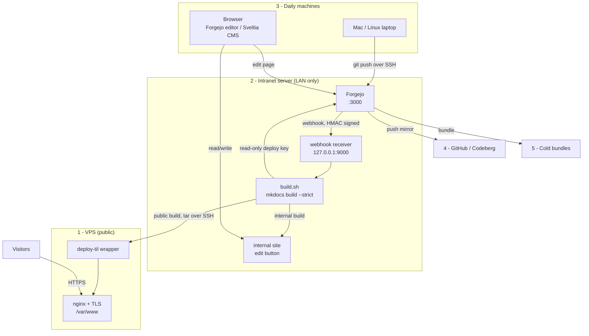

# Self-hosting this TIL site: Forgejo on the LAN, static VPS

A runbook for building, publishing and backing up this site. Git hosting and
the build stay inside the LAN. The public VPS serves static files only.

!!! note "About the placeholders"
    Values in `ANGLE_BRACKETS` are specific to my machines and are not
    published. Substitute your own.

## The machines

| # | Role | Runs |
| --- | --- | --- |
| 1 | VPS (public) | nginx, certbot. Static files only |
| 2 | Intranet server | Forgejo, webhook receiver, MkDocs build, internal site |
| 3 | Daily machines | Mac, Linux laptop, browser |
| 4 | GitHub / Codeberg | automatic push mirror |
| 5 | Cold storage | dated bundles on external disk / NAS |

## How it connects



Every connection is initiated from inside the LAN. The VPS holds no
credentials and no route to any other machine.

## 1. Prepare the intranet server

```bash
sudo apt update
sudo apt install git python3 rsync nginx
curl -LsSf https://astral.sh/uv/install.sh | sh    # uv, for the build venv
```

## 2. Install Forgejo

Follow the [official binary installation](https://forgejo.org/docs/latest/admin/installation/binary/)
exactly. Version 12.0 or later is required for the CMS in step 11.

```bash
curl -sSLO https://codeberg.org/forgejo/forgejo/releases/download/v<VERSION>/forgejo-<VERSION>-linux-amd64
sudo install -m 755 forgejo-<VERSION>-linux-amd64 /usr/local/bin/forgejo

sudo adduser --system --shell /bin/bash --gecos 'Git Version Control' \
  --group --disabled-password --home /home/git git

sudo mkdir /var/lib/forgejo && sudo chown git:git /var/lib/forgejo && sudo chmod 750 /var/lib/forgejo
sudo mkdir /etc/forgejo && sudo chown root:git /etc/forgejo && sudo chmod 770 /etc/forgejo

sudo wget -O /etc/systemd/system/forgejo.service \
  https://codeberg.org/forgejo/forgejo/raw/branch/forgejo/contrib/systemd/forgejo.service
sudo systemctl daemon-reload
sudo systemctl enable forgejo
```

Write the config **before** first start, with all four secrets supplied and
`INSTALL_LOCK` set. Generate each with
`forgejo generate secret <SECRET_KEY|INTERNAL_TOKEN|JWT_SECRET|LFS_JWT_SECRET>`.

```ini
APP_NAME = <NAME>
RUN_USER = git
RUN_MODE = prod
WORK_PATH = /var/lib/forgejo

[server]
PROTOCOL         = http
DOMAIN           = <LAN_ADDRESS>
ROOT_URL         = http://<LAN_ADDRESS>:3000/
HTTP_ADDR        = <LAN_OR_VPN_ADDRESS>
HTTP_PORT        = 3000
APP_DATA_PATH    = /var/lib/forgejo/data
DISABLE_SSH      = false
START_SSH_SERVER = false
SSH_PORT         = 22
SSH_DOMAIN       = <LAN_ADDRESS>
LFS_START_SERVER = true
LFS_JWT_SECRET   = <GENERATED>
OFFLINE_MODE     = true

[database]
DB_TYPE = sqlite3
PATH    = /var/lib/forgejo/data/forgejo.db

[repository]
ROOT = /var/lib/forgejo/data/forgejo-repositories

[security]
INSTALL_LOCK   = true
SECRET_KEY     = <GENERATED>
INTERNAL_TOKEN = <GENERATED>

[oauth2]
JWT_SECRET = <GENERATED>

[service]
DISABLE_REGISTRATION = true

[webhook]
# Required: the receiver in step 8 listens on loopback, which Forgejo
# blocks by default as SSRF protection.
ALLOWED_HOST_LIST = loopback

[log]
MODE      = console
LEVEL     = info
ROOT_PATH = /var/lib/forgejo/log

[mailer]
ENABLED = false
```

Write it as a file and install it rather than pasting a heredoc into a shell:

```bash
sudo install -o root -g git -m 640 app.ini /etc/forgejo/app.ini
sudo chmod 750 /etc/forgejo
sudo systemctl start forgejo
```

Create the admin account, then enable 2FA in the web UI:

```bash
sudo -u git /usr/local/bin/forgejo admin user create --admin \
  --username <USER> --email <EMAIL> --random-password \
  -w /var/lib/forgejo -c /etc/forgejo/app.ini
```

No nginx or TLS is needed for Forgejo: it is reachable only from the LAN.

## 3. Reach it from outside the LAN

Install Tailscale (or WireGuard) on the intranet server and every daily
machine, and bind Forgejo's `HTTP_ADDR` to the VPN address.

```bash
curl -fsSL https://tailscale.com/install.sh | sh
sudo tailscale up
```

Editing from a phone or while travelling requires the device on the VPN.

## 4. Add SSH keys

On each daily machine:

```bash
ssh-keygen -t ed25519 -C "<MACHINE_NAME>"
```

Add each public key in Forgejo under **Settings → SSH / GPG Keys**, then:

```bash
ssh -T git@<LAN_ADDRESS>
```

## 5. Create the repository

Create an empty repository in Forgejo, then from a daily machine:

```bash
git remote add origin git@<LAN_ADDRESS>:<USER>/til.git
git push -u origin main
```

## 6. Two builds: public and internal

The edit button must not appear on the public site. Rather than hiding it with
scripting, the site is built twice.

`mkdocs.yml` (public) carries no `repo_url` and no `edit_uri`, so Material
renders no edit button and no repository link.

`mkdocs.internal.yml` adds them, taking the host from the environment so the
internal address is never committed:

```yaml
INHERIT: ./mkdocs.yml

repo_url: !ENV [FORGEJO_REPO_URL, "http://localhost:3000/<USER>/til"]
edit_uri: "_edit/main/docs/"
```

```bash
mkdocs build --strict                             # public  -> VPS
FORGEJO_REPO_URL=http://<LAN_ADDRESS>:3000/<USER>/til \
  mkdocs build --strict -f mkdocs.internal.yml    # internal -> LAN
```

## 7. The hosting project

Static hosting lives in its own directory, separate from Forgejo:

```
~/web_services/til.anandas.in/
├── til.anandas.in.conf      # remote, branch, ports, deploy target
├── justfile                 # just build / serve / stop / status
├── scripts/
│   ├── build.sh             # sync, build both, verify, promote
│   ├── serve.sh             # local nginx containers
│   └── webhook-receiver.py
├── .ssh/deploy_key          # read-only, repo-scoped
├── src/                     # working clone
└── static_hosting/{public,internal}
```

Generate a **read-only deploy key** for the build and add it in Forgejo under
**Repository → Settings → Deploy Keys**, leaving write access unchecked:

```bash
ssh-keygen -t ed25519 -f ~/web_services/til.anandas.in/.ssh/deploy_key -N ""
```

`build.sh` fetches with that key, builds both variants into temporary
directories, and only promotes them if two checks pass:

* the public output contains no `Edit this page`
* the public output contains no occurrence of the Forgejo host

Promote with `rsync -a --delete` **into** the existing directories. Do not
replace them — see the gotchas below.

## 8. Auto-build on push

A small receiver runs as the user that owns the web root, so no step in the
publish path needs root.

```python
body = self.rfile.read(int(self.headers.get("Content-Length", 0)))
sent = self.headers.get("X-Forgejo-Signature", "")
expected = hmac.new(SECRET, body, hashlib.sha256).hexdigest()
if not hmac.compare_digest(sent, expected):      # constant time
    self.send_response(403); return
```

It must verify the signature, return immediately (Forgejo times out in
seconds while a build takes longer), serialise builds with a lock, and ignore
refs other than `main`.

Run it as a systemd **user** service, bound to `127.0.0.1` only:

```bash
systemctl --user enable --now til-webhook
```

Then in Forgejo, **Repository → Settings → Webhooks → Forgejo**:

| Field | Value |
| --- | --- |
| Target URL | `http://127.0.0.1:9000/` |
| Method / Content type | `POST` / `application/json` |
| Secret | the receiver's shared secret |
| Trigger | Push events, branch filter `main` |

Use **Test Delivery** to confirm. This requires `ALLOWED_HOST_LIST = loopback`
from step 2.

## 9. Serve the internal site on the LAN

Bind it to the LAN/VPN address only. This is the copy with edit buttons; use
it when writing, and the public URL when reading.

```nginx
server {
    listen <LAN_OR_VPN_ADDRESS>:80;
    server_name <LAN_HOSTNAME_SITE>;
    root /home/<USER>/web_services/til.anandas.in/static_hosting/internal;
    index index.html;
    location / { try_files $uri $uri/ =404; }
}
```

## 10. Publish the public site to the VPS

The VPS needs nginx only. No git, no Python, no secrets.

```bash
sudo apt install nginx
sudo adduser --disabled-password --gecos "" deploy
sudo mkdir -p /var/www/releases && sudo chown deploy:deploy /var/www/releases
```

`/usr/local/bin/deploy-til` receives a tar on stdin and swaps atomically:

```bash
#!/bin/bash
set -euo pipefail
rel="/var/www/releases/$(date +%Y%m%d-%H%M%S)"
mkdir -p "$rel"; tar -xz -C "$rel"
[ -f "$rel/index.html" ] || { rm -rf "$rel"; echo "no index.html" >&2; exit 1; }
ln -sfn "$rel" /var/www/til.tmp
mv -T /var/www/til.tmp /var/www/til.anandas.in
ls -dt /var/www/releases/* | tail -n +6 | xargs -r rm -rf
```

Restrict the deploy key on the VPS so it can do nothing else:

```
command="/usr/local/bin/deploy-til",no-pty,no-agent-forwarding,no-port-forwarding,no-X11-forwarding ssh-ed25519 AAAA... deploy@til
```

The intranet build then publishes with:

```bash
tar -cz -C static_hosting/public . | ssh -i <KEY> -p <SSH_PORT> deploy@<VPS_HOST>
```

nginx on the VPS, then certbot:

```nginx
server {
    listen 80;
    server_name til.anandas.in;
    root /var/www/til.anandas.in;
    index index.html;
    location / { try_files $uri $uri/ =404; }
    error_page 404 /404.html;
    location ~* \.(css|js|png|jpg|jpeg|gif|svg|woff2?|ico)$ {
        expires 30d;
        add_header Cache-Control "public";
    }
    gzip on;
    gzip_types text/css application/javascript application/json image/svg+xml;
    gzip_min_length 1024;
}
```

```bash
sudo certbot --nginx -d til.anandas.in
sudo certbot renew --dry-run
```

## 11. Sveltia CMS

Requires Forgejo 12.0 / Gitea 1.24 or later. In Forgejo:
**Settings → Applications → Create OAuth2 Application**.

* Redirect URI: `http://<LAN_HOSTNAME_SITE>/admin/`
* Uncheck **Confidential** — the CMS uses PKCE, so there is no client secret
  and no auth broker to run

`docs/admin/config.yml`:

```yaml
backend:
  name: gitea
  repo: <USER>/til
  base_url: http://<LAN_ADDRESS>:3000
  api_root: http://<LAN_ADDRESS>:3000/api/v1   # /api/v1 is required
  app_id: <CLIENT_ID>
  branch: main

media_folder: docs/content/images
public_folder: /content/images

collections:
  - name: pages
    label: Pages
    folder: docs/content
    create: true
    nested: { depth: 4 }
    extension: md
    format: frontmatter
    fields:
      - { name: title, label: Title, widget: string }
      - { name: tags, label: Tags, widget: list, required: false }
      - { name: body, label: Body, widget: markdown }
```

Serve `/admin` from the LAN only. The CMS calls the Forgejo API from the
browser, so publishing `/admin` on the VPS would break for anyone off the VPN.

## 12. Navigation without editing mkdocs.yml

New pages must appear without hand-editing `mkdocs.yml`, or the `--strict`
build fails and nothing publishes.

```
mkdocs-awesome-nav      # in requirements.in
```

```yaml
plugins:
  - awesome-nav
```

Set titles and ordering per directory with `.nav.yml`:

```yaml
title: linux-infra
nav:
  - Nginx.md
  - certbot.md
  - "*"
```

`"*"` matches everything not listed, so a new file appears with no config
change.

## 13. Mirror to GitHub / Codeberg

An off-site copy that costs nothing to maintain. Forgejo pushes to it
automatically; the remote is never edited by hand.

**On GitHub** — Settings → Developer settings → Personal access tokens →
Fine-grained tokens → Generate new:

* Repository access: **Only select repositories** → the mirror repository
* Permissions: **Contents → Read and write** (nothing else is needed)
* Store it: `pass insert til/github-token`

**In Forgejo** — Repository → Settings → **Mirror Settings** → Add Push Mirror:

| Field | Value |
| --- | --- |
| Remote Repository URL | `https://github.com/<USER>/<REPO>.git` |
| Authorization | username, and the token as the password |
| Sync when new commits are pushed | checked |

Then **Synchronize Now**.

Verify it properly rather than trusting the UI: push a commit to Forgejo
only, wait, and confirm the remote moved on its own.

```bash
git push origin main                 # Forgejo only
sleep 30
git fetch github && git rev-parse --short main github/main   # must match
```

!!! warning "The mirror is strictly read-only"
    Each sync force-updates the remote, so a commit made **on GitHub** is
    silently destroyed on the next push. On any clone, block it:

    ```bash
    git remote set-url --push github no_push://mirror-is-read-only
    ```

## 13a. Secrets

Four secrets exist in this setup. None belong in a repository.

| Secret | Where it lives | If lost |
| --- | --- | --- |
| Forgejo `SECRET_KEY`, `INTERNAL_TOKEN`, `JWT_SECRET`, `LFS_JWT_SECRET` | `/etc/forgejo/app.ini`, `root:git 640` | in the `forgejo dump` archive |
| Webhook HMAC secret | `pass til/webhook-secret` | regenerate, update the hook in Forgejo |
| Build deploy key | `.ssh/deploy_key`, mode 600 | regenerate, replace the deploy key in Forgejo |
| GitHub mirror token | `pass til/github-token` | issue a new token, update Mirror Settings |

`pass` is the source of record for the shared secrets. `hook-install.sh`
reads `til/webhook-secret` from it, generating one on first run:

```bash
pass insert til/webhook-secret     # or let hook-install.sh create it
pass show til/webhook-secret       # to paste into Forgejo's webhook
```

The secret is read once at install time and written into the systemd unit
(mode 600), because a service starting at boot cannot prompt to unlock a GPG
key. `pass` is therefore the durable record, not the runtime source.

**The SSH deploy key stays a file.** A mode-600 private key is already the
conventional secure form; putting it in `pass` would mean writing it back to
disk at build time, which is worse. Keep a copy in `pass` only if you would
rather restore it than re-register a new one.

**Rotate, don't recover.** Any of these can be regenerated in under a minute,
and the correct response to a lost or exposed secret is a new one plus
revocation of the old — never an attempt to retrieve the original.

Gitignore them, and verify before the first commit of any hosting project:

```bash
git ls-files | grep -E '\.ssh/|secret|token' && echo "STOP: secret staged"
```

## 14. Cold backups

Forgejo lives on the intranet server, so its disk cannot be the only copy.
Write bundles to a different machine or an external disk, only when the refs
have changed:

```bash
before=$(git -C "$REPO" rev-parse --all | sha256sum)
git -C "$REPO" remote update            # deliberately no --prune
after=$(git -C "$REPO" rev-parse --all | sha256sum)
[ "$before" = "$after" ] || { git -C "$REPO" bundle create "$f" --all; git bundle verify "$f"; }
```

Run it from a persistent timer so a missed run happens at next boot:

```ini
[Timer]
OnCalendar=daily
Persistent=true
```

Dump the instance itself for users and settings:

```bash
sudo -u git forgejo dump -c /etc/forgejo/app.ini -f <COLD_STORAGE>/forgejo-$(date +%F).zip
```

## Gotchas

Things that cost time on the first build of this setup.

**The service hangs on `systemctl start`.** The upstream unit is `Type=notify`.
If `INSTALL_LOCK` is not set, Forgejo parks on the web installer and never
signals readiness, so systemd waits the full 90 s timeout and kills it.
Pre-seed `app.ini` instead of using the wizard.

**Fatal `permission denied` writing `app.ini`.** Forgejo generates
`JWT_SECRET` and `LFS_JWT_SECRET` on first start and persists them into the
config. With `app.ini` as `root:git 640` that write fails and the service
crash-loops. Supply all four secrets up front, or make the file writable by
`git`. Supplying them keeps the config read-only and reproducible.

**Webhooks to localhost are refused.** Forgejo blocks loopback and private
targets as SSRF protection, failing with `deny '127.0.0.1'`. Set
`ALLOWED_HOST_LIST = loopback` — the narrowest value that works. Avoid `*`.

**Prefer the system sshd over the built-in SSH server.** With
`START_SSH_SERVER = true`, a correctly registered `ed25519` key was rejected
with no log line at any level. `START_SSH_SERVER = false` with `SSH_PORT = 22`
uses OpenSSH and `/home/git/.ssh/authorized_keys`, which works. If
`sshd_config` has an `AllowUsers` line, `git` must be added to it.

**A `post-receive` hook is the wrong tool here.** Under the standard install
the repositories are owned by `git` with mode `750`, so installing a custom
hook needs root, and the hook then runs as `git` — which cannot write build
output into another user's home. Use a webhook and a receiver running as the
user that owns the web root.

**Do not replace a bind-mounted directory.** Docker pins a bind mount to the
inode it saw at container start. Promoting a build with `rm -rf` + `mv`
orphans the mount, and the container serves the old, unlinked copy while the
build reports success. Use `rsync -a --delete` into the existing directory.

**Use a read-only deploy key for the build.** The machine running the build
needs its own key. A per-repo deploy key without write access is enough, and
is preferable to reusing a personal account key.

**`rsync --delete-excluded` deletes excluded files from the destination.**
It is not "`--delete`, but safer about excludes" — it is the opposite. Used
against a project directory whose excludes were `.ssh/`, `.webhook-secret`,
`src/` and `static_hosting/`, it destroyed the deploy key, the webhook
secret and the served output in one command. Use plain `--delete` to prune
files absent from the source, and `--dry-run` first whenever the destination
holds anything not reproducible.

**Check that a file exists, not just that git ignores it.** A verification
step that reports "ok: not tracked" is equally happy about a correctly
ignored file and a file that has been deleted. When the check protects
something irreplaceable, assert existence and permissions too.

**Never load third-party scripts you do not control.** This site loaded
`polyfill.io` on every page for years, inherited from an old MathJax example.
That domain changed hands in 2024 and began serving malware. Audit
`extra_javascript` and `extra_css` for external hosts, and vendor what you
can.

## Security setup

| Control | Setting |
| --- | --- |
| Forgejo exposure | LAN / VPN only, never published, no TLS needed |
| VPS contents | static files, nginx, certbot. No git, no Python, no secrets |
| VPS inbound | `<SSH_PORT>`, 80, 443 only |
| Deploy key (to VPS) | `command="/usr/local/bin/deploy-til"`, no pty, no forwarding |
| Deploy key (to repo) | read-only, repo-scoped |
| Connection direction | LAN initiates everything. The VPS cannot reach inward |
| Webhook | HMAC-SHA256, constant-time compare, loopback-bound receiver |
| SSH | keys only, root login disabled, non-default port on the VPS |
| Forgejo accounts | registration disabled, 2FA on every account |
| CMS auth | PKCE, public client, no stored secret |
| Edit affordance | public build has no `repo_url`, so no edit button and no Forgejo host in the output |
| Publish | `--strict` build, leak checks, atomic swap |
| Backups | push mirror off-site, bundles on separate cold storage |

!!! question "Does publishing this help an attacker?"
    The layout, no. Security here rests on keys, network position and
    patching, not on secrecy of the design. What must never be published are
    the values: addresses, ports, account names, tokens and key material.
    Those stay in `ANGLE_BRACKETS` above.

## Restore

**Losing the VPS** costs nothing but uptime. Rebuild a host, repeat step 10,
then push any commit to trigger a fresh deploy.

**Losing the intranet server:**

1. Reinstall Forgejo (steps 1-2).
2. Restore the repository from the newest source — the mirror (step 13) or a
   bundle (step 14):

    ```bash
    git clone <COLD_STORAGE>/til-<DATE>.bundle til
    ```

3. Push it to the new Forgejo, re-add the deploy key and webhook.
4. Restore accounts from the `forgejo dump` archive, or recreate them by
   following this page.

Verify the chain once a year on a spare machine:

```bash
git clone <COLD_STORAGE>/til-<DATE>.bundle /tmp/restore-test
cd /tmp/restore-test
uv venv .venv && uv pip install --python .venv/bin/python -r requirements.in
.venv/bin/mkdocs build --strict
```
